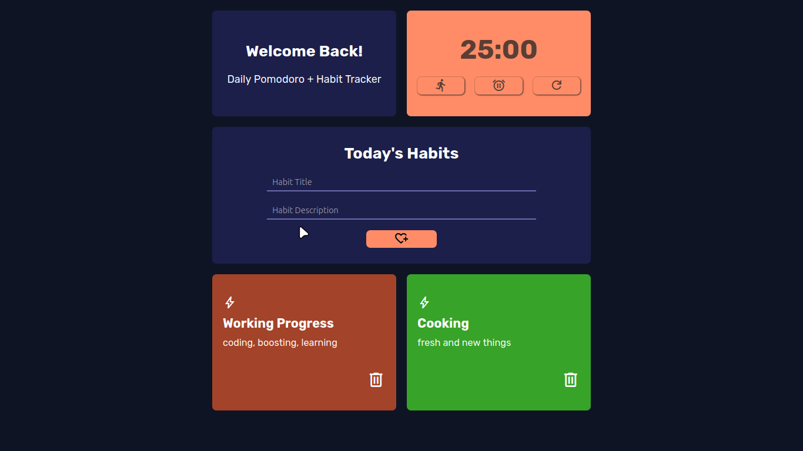

<h1 align="center">⏱️ Pomodoro + Habit Tracker App</h1>

<p align="center">
  A minimal and responsive web app to boost your productivity using the <strong>Pomodoro Technique</strong> + <strong>Daily Habit Tracking</strong>.
</p>

<p align="center">
  <a href="https://rjsudhin.github.io/pomodoro-habit-tracker-app/" target="_blank">
    🔗 Live Demo
  </a>
</p>

<p align="center">
  
  
  
  
</p>

---

## 🚀 Live Preview

🔗 **[Try it now](https://rjsudhin.github.io/pomodoro-habit-tracker-app/)** — No installation needed!

---

## 📸 Screenshot




---

## ✨ Features

✅ Simple Pomodoro timer interface (UI ready)  
✅ Add/Delete habit cards dynamically  
✅ Random color generation for each card  
✅ Persistent data using `localStorage`  
✅ Responsive mobile-friendly layout  
✅ Clean and minimalist UI with icons

---

## 🛠️ Built With

- **HTML5**
- **CSS3**
- **Vanilla JavaScript**
- **LocalStorage API**
- **GitHub Pages** for deployment

---

## 📁 Project Structure
```bash
📦 pomodoro-habit-tracker-app
├── index.html
├── styles.css
├── js/
│ └── app.js
└── screenshot.png
```

---

## 🧠 Upcoming Features

- **Functional Pomodoro countdown timer**
- **Pomodoro session tracking history**
- **Drag-and-drop habit cards**
- **Sound & notification support**

---

## 📄 License
This project is licensed under the MIT License — feel free to use and modify!

---

## 🙌 Author

Made with ❤️ by Sudhin Raj
Feel free to ⭐ star the repo if you like it!

---